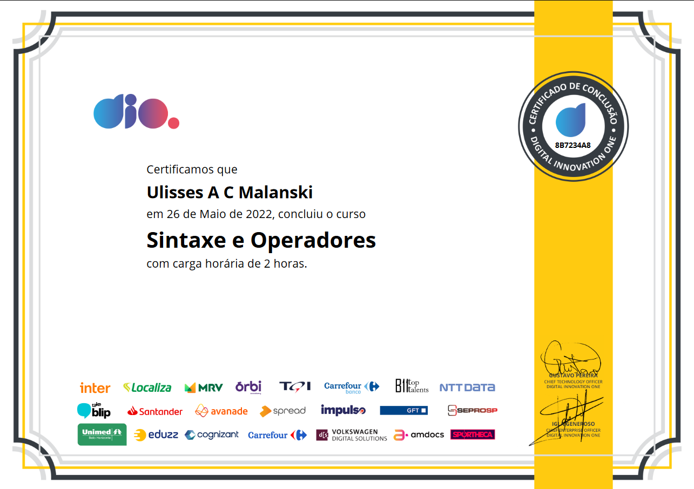
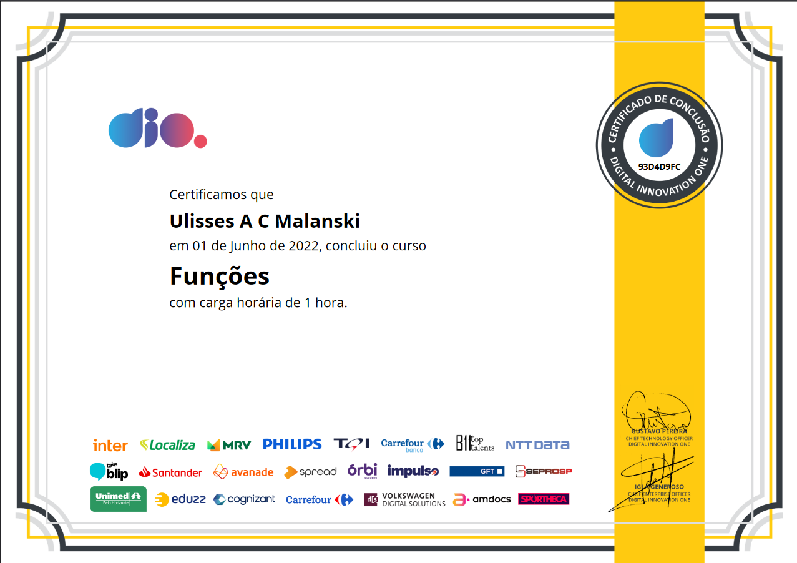
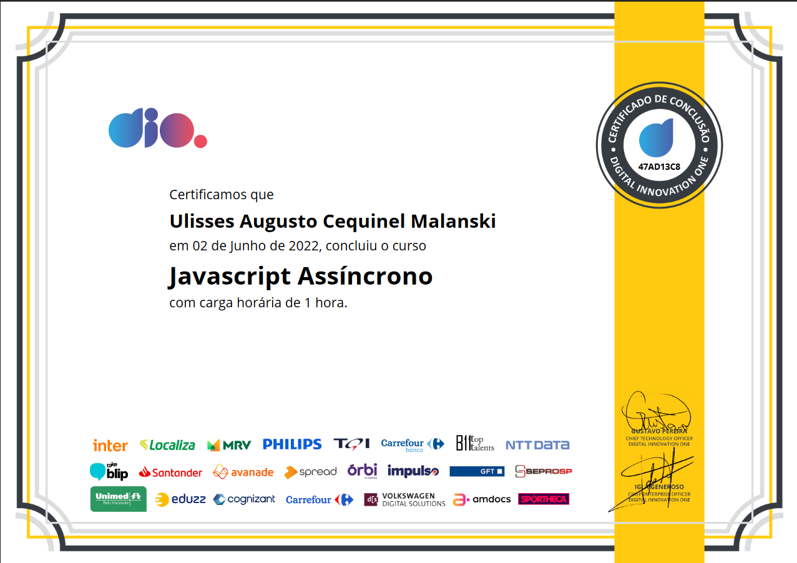

  
  
[DIO - Digital Innovation One](https://web.dio.me)  
  
This repository contains the practical activity of the JavaScript Base camp Course. 
  
# JavaScript Base Camp Activities
- Instructor JavaScript: Stephany Nusch  
### TQI Fullstack Developer

    

- Bootcamp at Digital Innovation One  

#### Objectives
  
Learn the Fundamentals about JavaScript 

#### Certifications    

  
    

